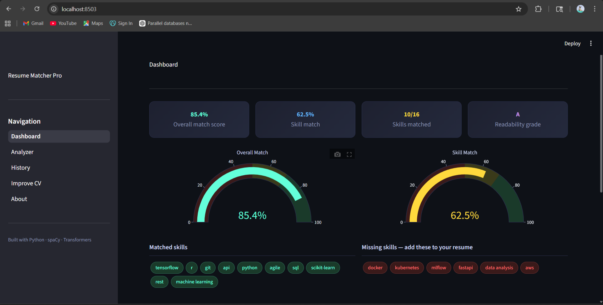
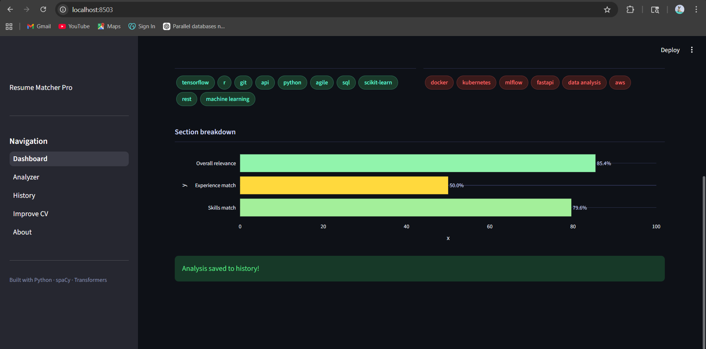
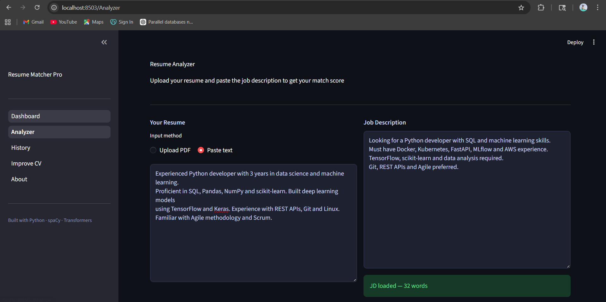
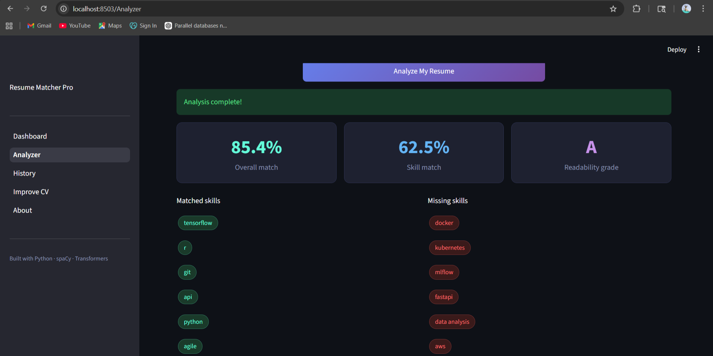
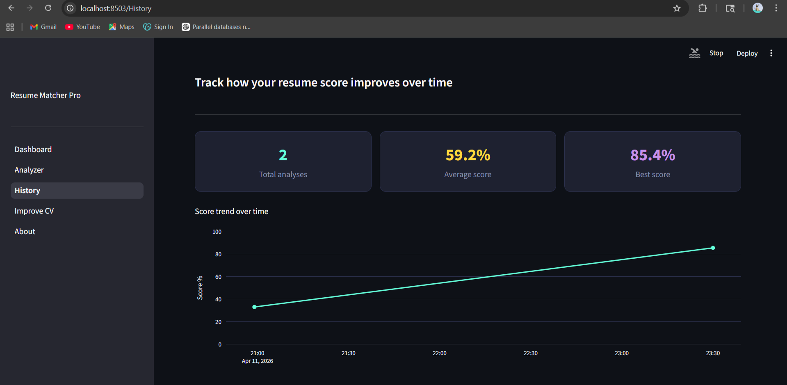
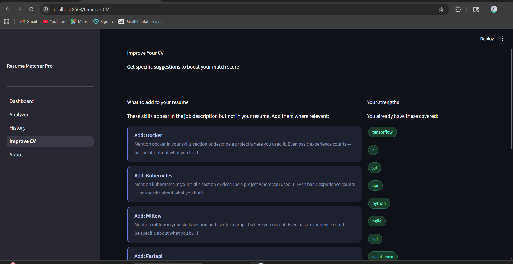
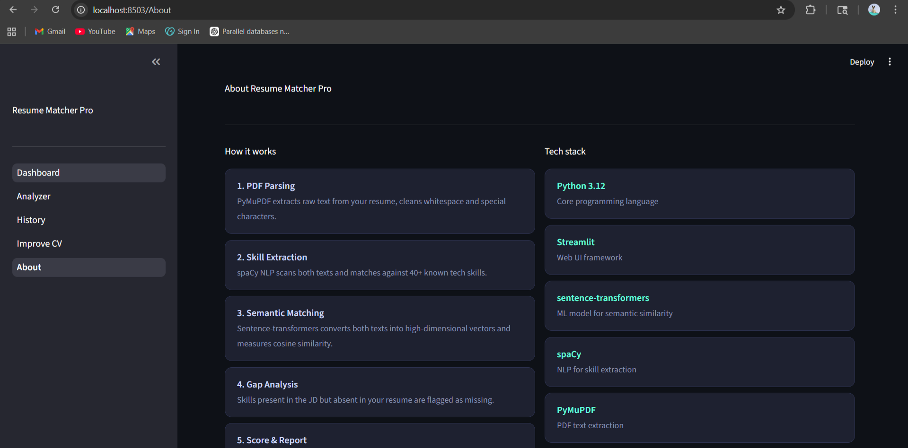
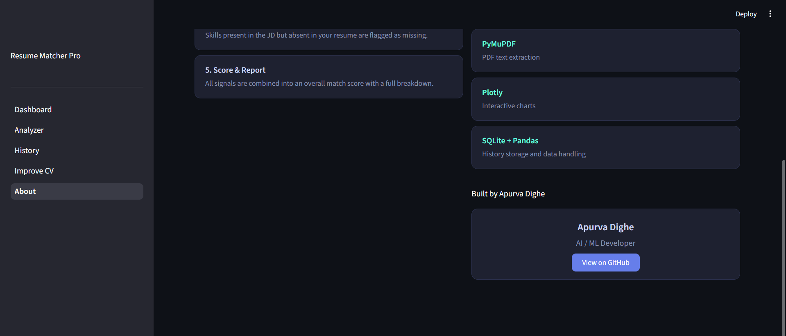

# 📊 Resume Matcher Pro

An AI-powered web app that analyzes how well your resume matches a job description. Upload your resume, paste a job description, and instantly get a semantic match score, skill gap report, and suggestions to improve your CV.

---

## Screenshots

**Home / Dashboard**




**Analyzer — upload your resume and paste the JD**




**History — track your score over time**



**Improve CV — get specific suggestions**



**About**




---

## What it does

You paste a job description and upload your resume as a PDF (or paste the text). The app runs it through a transformer ML model and gives you:

- An overall match score from 0–100%
- A skill-by-skill gap report showing exactly what's missing
- A section breakdown scoring your skills, experience and relevance separately
- A readability grade based on how clearly your resume is written
- Specific suggestions to rewrite weak bullet points
- A history page that tracks all your past analyses so you can see improvement over time

---

## How it works

The core matching uses `sentence-transformers` — a neural network model (`all-MiniLM-L6-v2`) that converts text into 384-dimensional vectors. Both your resume and the job description are encoded into these vectors, and cosine similarity is used to measure how semantically close they are. This means it understands meaning, not just keywords — so "built predictive models" and "machine learning experience" score as similar even though they share no words.

Skill extraction is handled by `spaCy` which scans both texts and identifies technical skills, frameworks and tools. The gap between what the JD requires and what your resume contains is shown as matched vs missing skills.

All analyses are saved to a local SQLite database so you can track your score across multiple job applications.

---

## Tech stack

- **Python 3.12** — core language
- **Streamlit** — multi-page web UI
- **sentence-transformers** — transformer model for semantic similarity
- **spaCy** — NLP for skill extraction
- **PyMuPDF** — PDF text extraction
- **Plotly** — interactive charts and gauge meters
- **SQLite + Pandas** — history storage and data handling
- **Streamlit Cloud** — deployment

---

## Run it locally

```bash
git clone https://github.com/apurvaa05/resume-matcher.git
cd resume-matcher

python -m venv venv
venv\Scripts\activate        # Windows
source venv/bin/activate     # Mac/Linux

pip install -r requirements.txt

streamlit run app.py
```

Then open `http://localhost:8501` in your browser.

---

## Project structure

```
resume-matcher/
├── app.py                    # Main dashboard
├── requirements.txt
├── pages/
│   ├── 1_Analyzer.py         # Resume upload and analysis
│   ├── 2_History.py          # Score history and trends
│   ├── 3_Improve_CV.py       # CV improvement suggestions
│   └── 4_About.py
├── components/
│   ├── parser.py             # PDF extraction
│   ├── matcher.py            # ML scoring
│   └── analyzer.py           # Skill extraction
└── data/                     # SQLite database
```

---

## Sample output

Tested with a Python developer resume against a Data Engineer job description:

- Overall match: **85.4%**
- Skill match: **62.5%**
- Readability grade: **A**
- Matched skills: python, sql, tensorflow, git, rest
- Missing skills: docker, kubernetes, mlflow, aws

---

## What's next

- Dynamic skill extraction using named entity recognition instead of a hardcoded list
- GPT-powered bullet point rewriting
- ATS score simulation
- User accounts with private history

---

Built by **Apurva** — [github.com/apurvaa05](https://github.com/apurvaa05)
